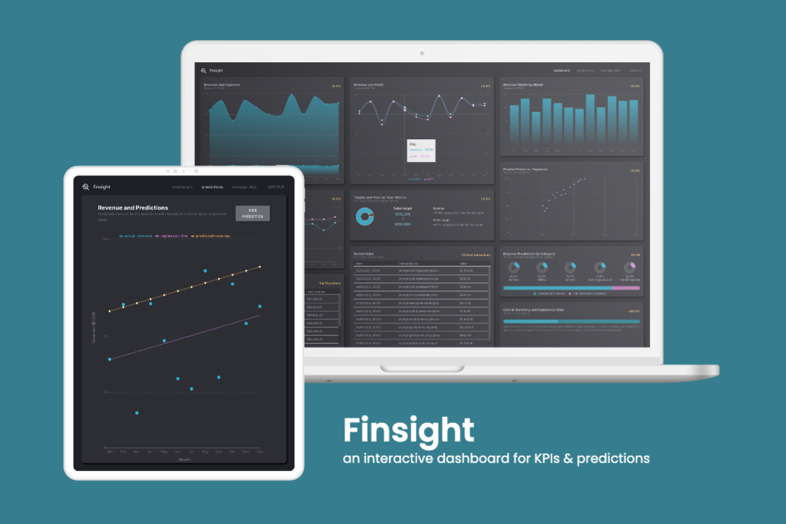
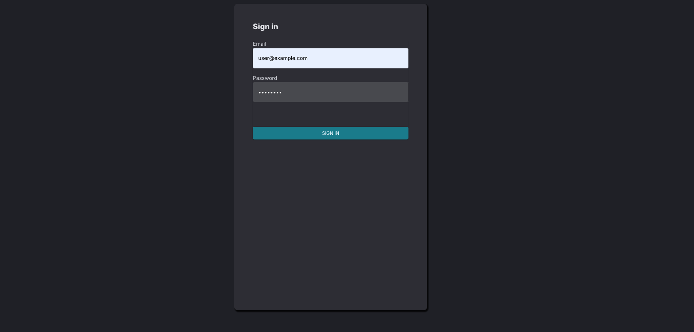

# Finsight

## Tech stack

Language: TypeScript

Front End: React, Vite, Redux, Material UI, Recharts, Regression

Back End: ExpressJS, NodeJS, Prisma

Database: PostegreSQL

Hosting: Vercel 

## Key features

### User login

### Dashboard page

### Predictions page

### Manage Data page

#### Revenue transactions

- Add new revenue transaction

- Update/delete existing revenue transaction

#### Expense transactions

- Add new expense transaction

- Update/delete existing expense transaction

#### Product list

- Add new product

- Update/delete existing product

